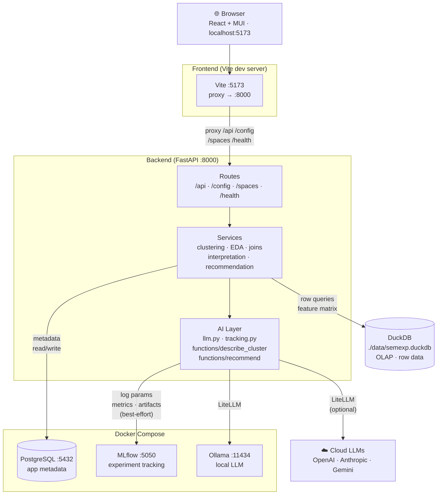
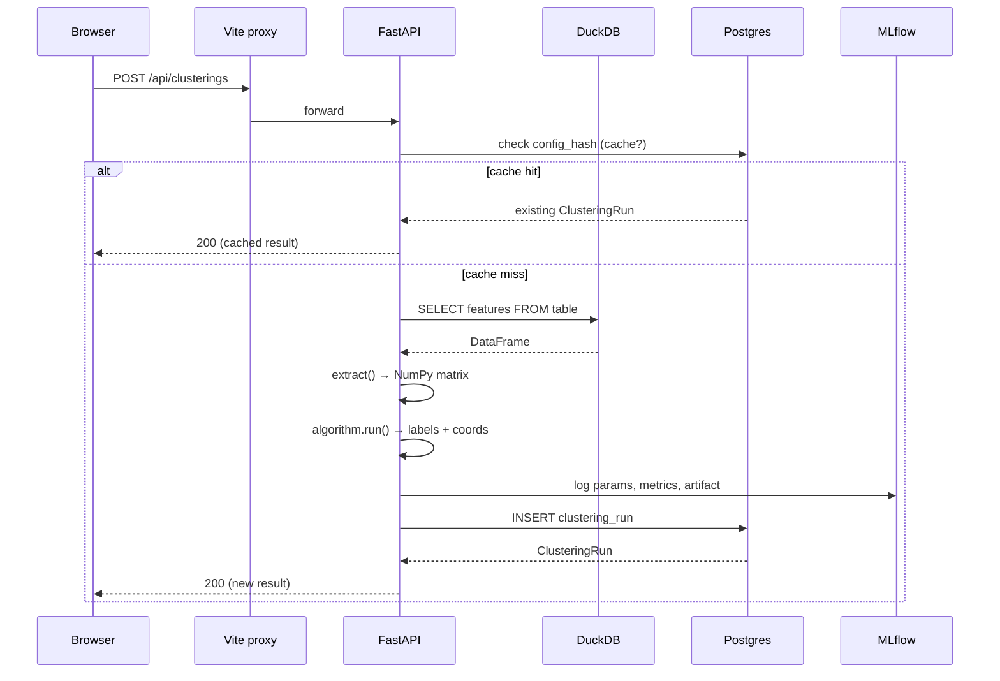
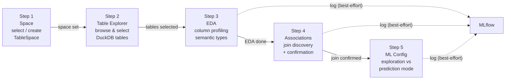

# Architecture

## High-level overview



### Request flow — Explorer clustering



### Config wizard flow



---

## Storage layer

### Postgres — application metadata

Postgres holds everything that describes *how* to explore data, not the data itself.

| Table | Purpose |
|-------|---------|
| `sources` | Connection config for a data source (kind + JSONB config) |
| `datasets` | A named view of a DuckDB table, owned by a source |
| `feature_groups` | User-defined column groupings with per-group default weight |
| `pipelines` | Named preprocessing pipelines (steps as JSONB) — defined but not yet active in the clustering path |
| `clustering_runs` | Immutable record of one clustering execution; content-addressed by `config_hash` |
| `pinned_clusterings` | Clustering runs promoted to production status |
| `interpretations` | Cached structured LLM output keyed by `(clustering_run_id, cluster_id)` |
| `actions` | Action templates with a JSON trigger rule |
| `recommendations` | Cached LLM recommendations at cluster or entity grain |
| `table_selections` | Which DuckDB tables a user selected for a source in the wizard |
| `column_annotations` | EDA profiling output (null %, distinct count, semantic type) per column |
| `join_suggestions` | Auto-discovered FK / overlap join candidates between tables |
| `table_spaces` | Named scope grouping tables; carries a space description for LLM context |
| `ml_configs` | Persisted ML tool configuration (exploration vs prediction mode + params) |
| `prompt_templates` | Versioned prompt texts (system prompt + user template) per LLM function |
| `llm_function_configs` | Per-function inference config: model override, temperature, max_tokens, active prompt FK |

All IDs are UUIDs. Timestamps default to `utcnow()`. JSONB columns store structured sub-documents (configs, steps, stats).

### DuckDB — analytical data

DuckDB holds the actual row data. It runs in-process as a file (`./data/semexp.duckdb`). Semexp never writes transformed output back to DuckDB — it reads raw rows, transforms them in Python (pandas + sklearn), and discards the intermediary.

The `duck()` singleton (`backend/core/duck.py`) returns a shared DuckDB connection. The two primary methods used across the codebase are:

- `duck().sql(query)` → returns a pandas DataFrame
- `duck().describe(table)` → returns a schema DataFrame with `column_name` and `column_type`

### MLflow — experiment tracking

MLflow runs as a Docker container with a SQLite backend and local artifact storage. Every clustering execution opens a parent MLflow run. LLM calls open child runs. The MLflow UI at `http://localhost:5050` shows full parameter, metric, and artifact history.

All MLflow logging outside the clustering pipeline (EDA runs in `eda_service.py`, join discovery runs in `join_service.py`, training schema runs in `prediction_service.py`) is **best-effort**: if the MLflow server is unavailable, these functions log a warning and return an empty `run_id` instead of propagating a 500. The safe `mlrun()` context manager in `backend/core/mlflow_client.py` handles the same pattern for clustering and LLM runs.

---

## Backend layer

### Settings (`backend/core/settings.py`)

`Settings` is a pydantic-settings `BaseSettings` subclass. It reads from `.env` (or environment variables). All other modules import the singleton `settings` from this module — no config is read directly from `os.environ` elsewhere.

### Database sessions (`backend/core/db.py`)

Two session utilities:

- `get_session()` — FastAPI dependency; yields a `Session`, commits on exit, rolls back on exception
- `session_scope()` — context manager for use outside of request context (e.g., the startup seed jobs)

### `BaseRepository[T]` (`backend/core/repository.py`)

Generic CRUD base over any SQLAlchemy model. Every concrete repository is ~5 lines that set `model = SomeModel` and optionally add custom finders. Standard methods:

```python
repo.get(id)            # → T | None
repo.get_or_raise(id)   # → T  (raises LookupError)
repo.list()             # → list[T]
repo.find_by(**filters) # → list[T]
repo.find_one(**filters)# → T | None
repo.create(**fields)   # → T
repo.update(id, **fields)
repo.delete(id)
```

### Domain models (`backend/domain/models.py`)

SQLAlchemy 2.0 mapped dataclasses using `Mapped` + `mapped_column`. One file for the entire schema skeleton. Relationships use `relationship()` with `back_populates`.

### Pydantic wire schemas (`backend/api/schemas.py`)

Separate from domain models. `*In` schemas validate incoming JSON; `*Out` schemas serialize outgoing responses. All `*Out` schemas inherit from `_Base` with `from_attributes=True` so SQLAlchemy model instances serialize directly.

### Route layer (`backend/api/routes/`)

Thin FastAPI routers. Each file mounts a router with a `/api` prefix. Routes depend-inject `Session` via `get_session()`, delegate to service functions, and map exceptions (`LookupError` → 404, `ValueError` → 400, general → 500).

Routers registered in `backend/api/main.py`:

| Router file | Resource |
|-------------|---------|
| `sources.py` | Sources, datasets, feature groups, DuckDB table schema |
| `clusterings.py` | Clustering runs, algorithm list, centroid profiles |
| `interpretations.py` | Structured and streaming LLM interpretations |
| `actions.py` | Action catalog CRUD |
| `recommendations.py` | Cluster and entity recommendations |
| `preprocessing.py` | Pipeline CRUD |
| `config.py` | Config wizard endpoints (EDA, join discovery, ML config) |
| `spaces.py` | Table Spaces CRUD |
| `llm_config.py` | LLM function configs and prompt template versions |

---

## Data pipeline

### Feature extraction (`backend/data/feature_extractor.py`)

`extract(duckdb_table, feature_groups)` produces the numeric matrix that clustering algorithms consume:

1. **Query** — `SELECT col1, col2, ... FROM table` via DuckDB
2. **Drop IDs** — columns whose name ends in `_id` or equals known ID names are excluded automatically
3. **Numeric columns** — standardized with `sklearn.preprocessing.StandardScaler` (fill NaN with column mean first)
4. **Categorical columns** — one-hot encoded with `pd.get_dummies`; NaN filled as `__missing__`
5. **Weight application** — each column in the encoded matrix is multiplied by its group weight; one-hot expansions inherit the weight of their source column

Returns an `ExtractionResult` with the NumPy matrix, post-encoding column names, original column names, and the row index (so results can be joined back to source rows).

### Clustering service (`backend/services/clustering_service.py`)

`run_clustering(session, req)` orchestrates the full pipeline:

1. Load `Dataset` and its `FeatureGroup`s from Postgres
2. Build the feature-group payload (name, columns, resolved weight)
3. SHA-256 hash the config — if a matching `ClusteringRun` already exists, return it immediately (cache hit)
4. Call `extract()` to get the NumPy matrix
5. Look up the algorithm from `REGISTRY`
6. Open an MLflow parent run; log params
7. Run the algorithm → labels array + extra info dict
8. Compute silhouette score (sampled at up to 1,000 points)
9. PCA(2) for scatter coordinates
10. Log metrics and algorithm artifact to MLflow
11. Persist a `ClusteringRun` in Postgres with the full result JSONB

The `result` JSONB stored in Postgres contains: `labels`, `coords`, `n_rows`, `n_features`, `cluster_sizes`, `feature_columns`, `pca_variance`, `extra`.

### Content-addressed caching

The config hash is:

```python
sha256(json.dumps({
    "t": duckdb_table,
    "w": feature_weights,
    "a": algorithm,
    "p": algorithm_params,
    "fg": feature_groups_payload,   # name + columns + resolved weight
}, sort_keys=True))
```

Identical inputs always produce the same hash. The `config_hash` column in `clustering_runs` has a `UNIQUE` constraint and an index. Cache hits skip all computation and return in milliseconds.

### Centroid profile

`cluster_centroid_profile(session, clustering_run_id, cluster_id)` computes z-scores for a single cluster:

1. Re-extract the full feature matrix (weight = 1.0 for profiling — unweighted centroid)
2. Compute overall population mean and std per feature
3. Compute cluster mean per feature
4. Return top-8 distinguishing features sorted by |z-score|

This function feeds the LLM prompt templates.

---

## Algorithm registry (`backend/services/algorithms.py`)

Each algorithm is a `ClusteringAlgorithm` subclass with:

- `meta: AlgorithmMeta` — name, display name, description, parameter spec dict
- `run(X, params) → (labels, extra)` — runs the algorithm, returns label array and extra info
- `log_model(run_id, X, labels, params)` — logs algorithm config as an MLflow artifact

The `REGISTRY` dict maps name strings to instances. `get_algorithm(name)` looks up by name. `list_algorithms()` serializes all metadata for the frontend.

Supported algorithms:

| Name | Class | sklearn estimator |
|------|-------|-------------------|
| `kmeans` | `KMeansAlgorithm` | `KMeans` |
| `dbscan` | `DBSCANAlgorithm` | `DBSCAN` |
| `agglomerative` | `AgglomerativeAlgorithm` | `AgglomerativeClustering` |
| `gmm` | `GaussianMixtureAlgorithm` | `GaussianMixture` |

---

## AI layer

### LLM chokepoint (`backend/ai/llm.py`)

Two public functions:

**`complete_structured(system, user, schema, temperature, max_tokens, model=None) → LLMResponse`**

Blocking call. Appends the JSON schema to the system prompt, requests `response_format: json_object`, parses the response, strips markdown fences if the model included them, and returns a validated `LLMResponse`. Raises `LLMError` if the model returns non-JSON or times out.

**`stream_completion(system, user, temperature, max_tokens, model=None) → Iterator[str]`**

Yields raw text tokens. No schema enforcement. Used for SSE narrative display.

Both functions accept an optional `model` override. When `model` is `None` they fall back to `settings.litellm_model`. The `api_base` parameter is only passed to LiteLLM when the resolved model name starts with `ollama/` — cloud providers resolve their endpoints from environment variables automatically.

### Prompt store (`backend/ai/prompt_store.py`)

All prompt texts are stored in Postgres as `PromptTemplate` records and loaded at inference time via `get_config(function_name) → PromptConfig`. If the DB is unreachable or a function has no active prompt, the store falls back to embedded Python string defaults in `_DEFAULTS` — so LLM calls never fail due to missing prompt files.

`PromptConfig` carries: `system`, `user_template`, `model` (nullable override), `temperature`, `max_tokens`, `version`, and `prompt_id`.

### MLflow tracking wrappers (`backend/ai/tracking.py`)

`tracked_complete()` and `tracked_stream()` wrap the LLM functions and log function name, prompt version, model, latency, and token counts to MLflow as child runs of the current parent. Both accept a `model` override that is threaded through to `llm.py`.

### Cognitive functions (`backend/ai/functions/`)

Two implemented cognitive function modules:

**`describe_cluster`** (`backend/ai/functions/describe_cluster.py`)

- `describe_cluster(payload: ClusterDescriptionInput) → ClusterDescriptionOutput` — structured blocking call
- `describe_cluster_stream(payload: ClusterDescriptionInput) → Iterator[str]` — streaming narrative

**`recommend`** (`backend/ai/functions/recommend.py`)

- `recommend_cluster_stream(...) → Iterator[str]` — streaming cluster-level recommendation
- `recommend_entity_stream(...) → Iterator[str]` — streaming entity-level recommendation

All four functions call `get_config(function_name)` to load prompt text and inference parameters from Postgres at call time. There are no file-path dependencies.

The `ClusterDescriptionOutput` schema enforces `headline` (str), `characteristics` (list of 2–4 str), and `confidence` (`high` | `medium` | `low`). `_normalize_output()` tolerates small local models returning dict objects inside the `characteristics` list.

### Interpretation service (`backend/services/interpretation_service.py`)

`interpret_cluster(session, run_id, cluster_id, refresh)`:
1. Check `InterpretationRepository` for an existing record — return it if `refresh=False`
2. Build the centroid profile via `cluster_centroid_profile()`
3. Attach the space description if a `TableSpace` exists for this source
4. Call `describe_cluster()` → structured output
5. Persist an `Interpretation` record in Postgres

---

## Source adapters (`backend/data/adapters/`)

`SourceAdapter` (`base.py`) defines two abstract methods:
- `ingest(duckdb_table: str)` — pulls data from the source into a DuckDB table
- `preview() → list[dict]` — returns sample rows for the wizard UI

Concrete adapters:

| Adapter | Status |
|---------|--------|
| `DuckDBNativeAdapter` | Full — reads existing DuckDB tables |
| `PostgresAdapter` | Full — queries Postgres, writes into DuckDB |
| `UnityCatalogAdapter` | Stub — raises `NotImplementedError` |
| `ParquetAdapter` | Not yet written |

The adapter registry in `adapters/__init__.py` maps `SourceKind` strings to adapter classes.

---

## Frontend architecture

### Tech stack

| Layer | Library |
|-------|---------|
| Framework | React 18 + TypeScript |
| UI components | MUI (Material UI) v5 |
| Charting | Chart.js 4 via `react-chartjs-2` |
| HTTP client | `fetch` wrapped in `api/client.ts` |
| Build | Vite |
| Dev proxy | Vite `proxy` config → `localhost:8000` (paths: `/api`, `/config`, `/spaces`, `/health`) |

### State management

No external state library. Global state is a single React context (`frontend/src/state/appContext.tsx`) that holds the active `TableSpace`. All other state is local to each page component via `useState` / `useEffect`.

### API client (`frontend/src/api/client.ts`)

Typed wrapper around `fetch`. All backend endpoints have a corresponding function. Errors are thrown as plain `Error` objects with the backend's detail string.

### Pages

| File | Description |
|------|-------------|
| `ExplorerPage.tsx` | Main clustering scatter page (3-panel layout) |
| `SourcesPage.tsx` | Source and feature group management |
| `PreprocessingPage.tsx` | Pipeline management |
| `ActionsPage.tsx` | Action catalog |
| `RecommendationsPage.tsx` | Recommendation browser |
| `LLMConfigPage.tsx` | LLM function + prompt management (model override, temperature, prompt versions) |
| `config/ConfigWizard.tsx` | Multi-step wizard shell |
| `config/Step*.tsx` | Individual wizard steps |

---

## Startup sequence

`backend/api/main.py` defines a FastAPI `lifespan` context manager that runs on startup:

1. `Base.metadata.create_all(engine)` — create all Postgres tables if they do not exist
2. `setup_mlflow()` — create the MLflow experiment if it does not exist
3. `seed_if_needed()` — generate the synthetic 1,500-row entity dataset into DuckDB (skipped if already present)
4. `_bootstrap_default_entities()` — register the DuckDB source, dataset, and five feature groups in Postgres (skipped if a source already exists)
5. `seed_loyalty()` — load the five CSV loyalty tables from `sample_data/loyalty/` into DuckDB (idempotent)
6. `_seed_default_space()` — create the `sample_loyalty` Table Space with two feature groups and generate its description
7. `seed_prompts()` — create one `LLMFunctionConfig` and one active `PromptTemplate` for each of the four LLM functions (`describe_cluster`, `describe_cluster_narrative`, `recommend_cluster`, `recommend_entity`); idempotent — skips any function that already has a config
